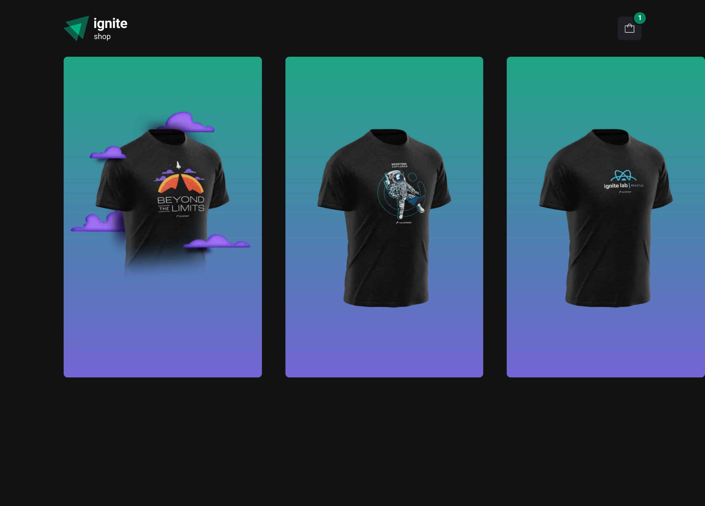
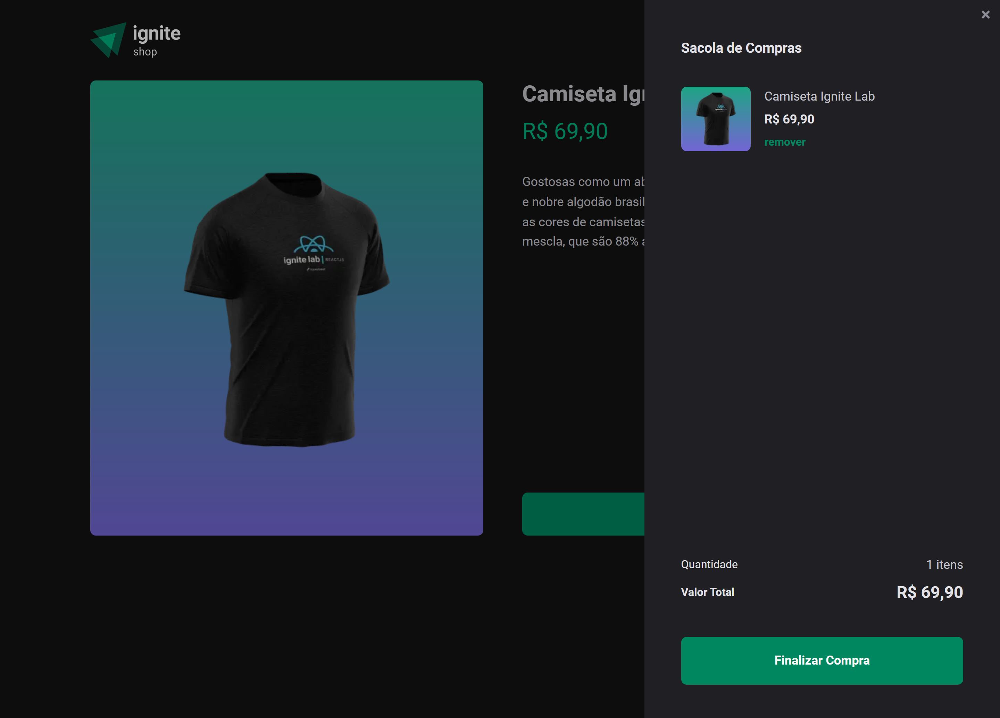

# Ignite Shop 2.0

<!---Esses são exemplos. Veja https://shields.io para outras pessoas ou para personalizar este conjunto de escudos. Você pode querer incluir dependências, status do projeto e informações de licença aqui--->


<!-- <a href="https://ignite-shop-sid.vercel.app/" target="_blank">Demo</a> -->



<br /> 
 
## 💻 Sobre

Similar ao Ignite Shop esse projeto tem como melhoria a possibilidade de se utilizar de um carrinho de comprar e assim sendo a compra de múltiplos produtos ao mesmo tempo, melhoras a experiencia do usuário e proporcionado uma plataforma e de E-commerce.

<br />

## 🖱 Pré-requisitos

Antes de começar, verifique se você atendeu aos seguintes requisitos:

- Você instalou a versão mais recente de `node / npm / yarn`

- Sera necessário uma conta no stripe com produtos para serem listados na plataforma
  <br />

## ☕ Usando o Ignite Shop 2.0

Para usar o Ignite Shop 2.0, siga estas etapas:

```
git clone https://github.com/SidneyRoberto9/ignite-shop-2.0

yarn ou npm i

yarn start ou npm start
```
